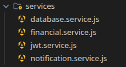
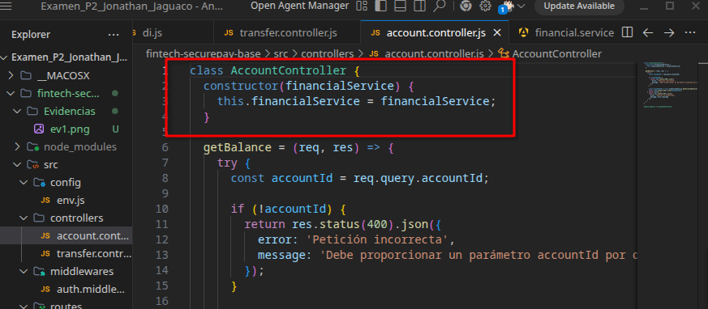
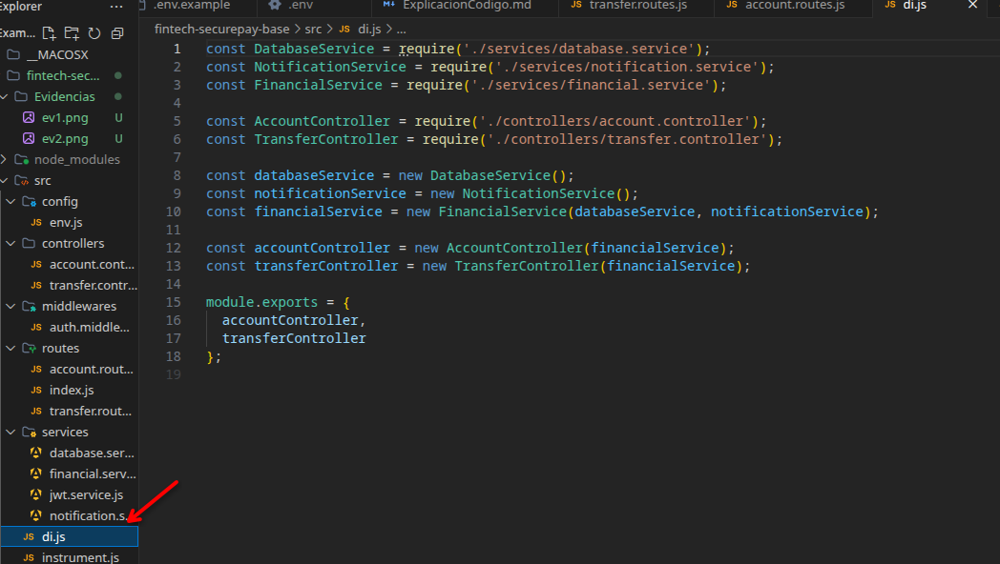
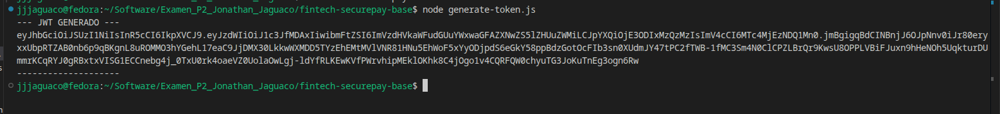
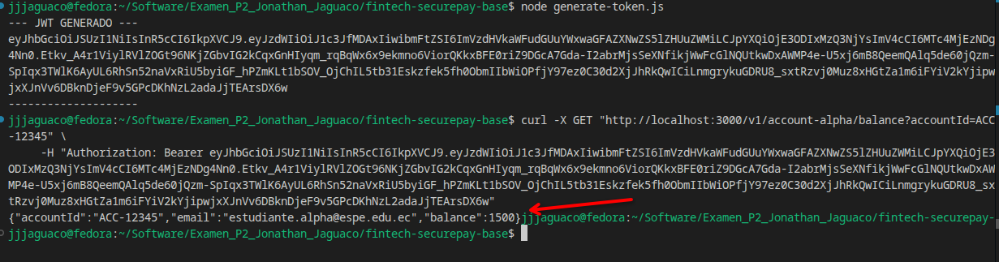
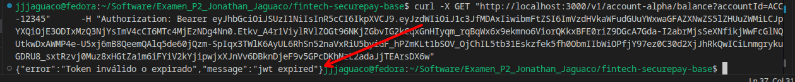
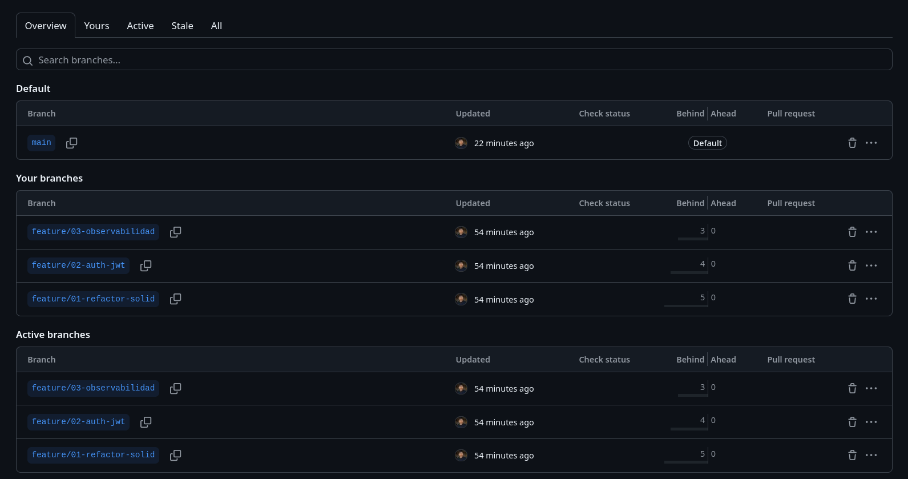

# Examen 2P - Fintech SecurePay Refactoring

## Bitácora de Evidencias

### Fase 1: Git Branching & Refactorización SOLIDo
Para evidenciar este procedimiento al archivo original el cual era transaction.monolith.service.js se identifico que se violaba 2 principios solid:
1. S: El archivo contenia mas de una responsabilidad, ya que manejaba la logica financiera, la base de datos en memoria y las notificaciones.
2. D: El archivo tenia dependencias de alto nivel y de bajo nivel, por lo que no se podia reutilizar la logica financiera en otro servicio.
- Solución: Se dividio este archivo en otros 3 archivos para asi lograr cumplir con el principio de responsabilidad unica y pe ara el segundo principio se aplicó la inyección de dependencias de modo que modificamos los Controladores account.controller.js  y transfer.controller.js para que funcionen a través de constructores con class

- Asi fue como creamos un archivo di.js para inyectar las dependencias

### Resultado:
La parte funcional de esta fase se mantiene igual no cambio unicamente se ven los cambios dentro de la legibilidad y mantenimiento dentro del codigo.

### Fase 2: Seguridad & Autenticación Asimétrica Stateless (JWT RS256)
Para evidenciar la resolución de esta fase se realizó el siguiente proceso.

- Keypar.sh: Este archivo se un generador de llaves privadas y publicas el cual es ejecutado en la terminal usando el comando openssl una llave privada generada para firmar y la otra publica para verifica
- .env: usado para definir las rutas de las llaves y no usar rutas fijas o "quemadas" en el código fuente
- Tambien aquí defini el .gitignore en el cual se encuentra los archivos .pem .env .env.example ya que estos no deben ser subidos al repositorio publico de github 
- Services/jwt.service.js: Modificamos el archivo para que use las llaves privadas y publicas para firmar y verificar los tokens,forzar una expiracion de 2 minutos y agregar el id del usuario en el token
- auti.middleware.js: Este de aqui extrae el header es decir el "autorization" verificando su beares si todo resulta bien entonces se procede a darle paso caso contrario nos vamos a una pantalla de error HTTP 401

**Evidencia 1: Token Generado por el script generate-token.js en la terminal**

**Evidencia Saldo Cuenta JWT valido**
- Se uso la herramienta de Curl dentro de Linux para probar de maenra rapida el endpoint con el token JWT obtenido.

**Evidencia JWT Expirado (Error 401)**
- Se volvio a realizar la misma petición con Curl pero como el token tiene un tiempo de uso y este expiro entonces el sistema no permite ingresar y nos vota este error

## Trazabilidad de Autoría (GitOps)
- Se manejaron ramas individuales: `feature/01-refactor-solid`, `feature/02-auth-jwt` y `feature/03-observabilidad`.
- Se aplicó la convención de Commits Semánticos (Ej: `refactor(solid): ...`, `feat(jwt): ...`, `feat(sentry): ...`).
